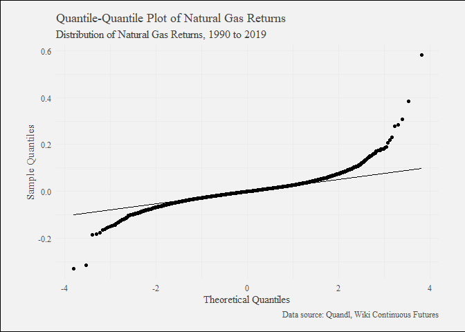

Algorithmic Trading with Natural Gas Futures
================

### 1\. Library Imports

``` r
library(forecast)
```

    ## Registered S3 methods overwritten by 'ggplot2':
    ##   method         from 
    ##   [.quosures     rlang
    ##   c.quosures     rlang
    ##   print.quosures rlang

    ## Registered S3 method overwritten by 'xts':
    ##   method     from
    ##   as.zoo.xts zoo

    ## Registered S3 method overwritten by 'quantmod':
    ##   method            from
    ##   as.zoo.data.frame zoo

    ## Registered S3 methods overwritten by 'forecast':
    ##   method             from    
    ##   fitted.fracdiff    fracdiff
    ##   residuals.fracdiff fracdiff

``` r
library(IKTrading)
```

    ## Loading required package: xts

    ## Loading required package: zoo

    ## 
    ## Attaching package: 'zoo'

    ## The following objects are masked from 'package:base':
    ## 
    ##     as.Date, as.Date.numeric

    ## Loading required package: Rcpp

    ## Loading required package: TTR

    ## Loading required package: quantmod

    ## Version 0.4-0 included new data defaults. See ?getSymbols.

    ## Loading required package: quantstrat

    ## Loading required package: blotter

    ## Loading required package: FinancialInstrument

    ## Loading required package: PerformanceAnalytics

    ## 
    ## Attaching package: 'PerformanceAnalytics'

    ## The following object is masked from 'package:graphics':
    ## 
    ##     legend

    ## Loading required package: foreach

    ## Loading required package: digest

    ## Loading required package: roxygen2

``` r
library(knitr)
library(PerformanceAnalytics)
library(quantmod)
library(quantstrat)
library(tidyverse)
```

    ## -- Attaching packages --------------------------------------- tidyverse 1.2.1 --

    ## v ggplot2 3.1.1     v purrr   0.3.2
    ## v tibble  2.1.1     v dplyr   0.8.1
    ## v tidyr   0.8.3     v stringr 1.4.0
    ## v readr   1.3.1     v forcats 0.4.0

    ## -- Conflicts ------------------------------------------ tidyverse_conflicts() --
    ## x purrr::accumulate() masks foreach::accumulate()
    ## x dplyr::filter()     masks stats::filter()
    ## x dplyr::first()      masks xts::first()
    ## x dplyr::lag()        masks stats::lag()
    ## x dplyr::last()       masks xts::last()
    ## x tidyr::spread()     masks FinancialInstrument::spread()
    ## x purrr::when()       masks foreach::when()

``` r
library(TTR)
```

### 2\. Importing Data and Exploratory Data Analysis

``` r
# Import Henry Hub Natural Gas Front Month Contract Data from Quandl
natgas <- read_csv("https://www.quandl.com/api/v3/datasets/CHRIS/CME_NG1.csv?api_key=rn2xyN_hG9XfxN_9ibFJ")
```

    ## Parsed with column specification:
    ## cols(
    ##   Date = col_date(format = ""),
    ##   Open = col_double(),
    ##   High = col_double(),
    ##   Low = col_double(),
    ##   Last = col_double(),
    ##   Change = col_double(),
    ##   Settle = col_double(),
    ##   Volume = col_double(),
    ##   `Previous Day Open Interest` = col_double()
    ## )

``` r
# Print the structure of the Natural Gas Data
str(natgas)
```

    ## Classes 'spec_tbl_df', 'tbl_df', 'tbl' and 'data.frame': 7327 obs. of  9 variables:
    ##  $ Date                      : Date, format: "2019-06-24" "2019-06-21" ...
    ##  $ Open                      : num  2.2 2.21 2.28 2.33 2.37 ...
    ##  $ High                      : num  2.32 2.22 2.3 2.36 2.4 ...
    ##  $ Low                       : num  2.19 2.18 2.16 2.27 2.32 ...
    ##  $ Last                      : num  2.3 2.2 2.21 2.28 2.33 ...
    ##  $ Change                    : num  0.117 0.001 0.091 0.052 0.058 0.001 0.062 0.061 0.013 0.042 ...
    ##  $ Settle                    : num  2.3 2.19 2.18 2.28 2.33 ...
    ##  $ Volume                    : num  66938 88581 196785 165138 116970 ...
    ##  $ Previous Day Open Interest: num  35429 57589 99439 128396 144054 ...
    ##  - attr(*, "spec")=
    ##   .. cols(
    ##   ..   Date = col_date(format = ""),
    ##   ..   Open = col_double(),
    ##   ..   High = col_double(),
    ##   ..   Low = col_double(),
    ##   ..   Last = col_double(),
    ##   ..   Change = col_double(),
    ##   ..   Settle = col_double(),
    ##   ..   Volume = col_double(),
    ##   ..   `Previous Day Open Interest` = col_double()
    ##   .. )

``` r
# Print the first 6 rows of the data.frame
head(natgas)
```

    ## # A tibble: 6 x 9
    ##   Date        Open  High   Low  Last Change Settle Volume `Previous Day Op~
    ##   <date>     <dbl> <dbl> <dbl> <dbl>  <dbl>  <dbl>  <dbl>             <dbl>
    ## 1 2019-06-24  2.20  2.32  2.19  2.30  0.117   2.30  66938             35429
    ## 2 2019-06-21  2.21  2.22  2.18  2.20  0.001   2.19  88581             57589
    ## 3 2019-06-20  2.28  2.30  2.16  2.21  0.091   2.18 196785             99439
    ## 4 2019-06-19  2.33  2.36  2.27  2.28  0.052   2.28 165138            128396
    ## 5 2019-06-18  2.37  2.40  2.32  2.33  0.058   2.33 116970            144054
    ## 6 2019-06-17  2.39  2.42  2.36  2.38  0.001   2.39 109985            168311

``` r
# Print the last 6 rows of the data.frame
tail(natgas)
```

    ## # A tibble: 6 x 9
    ##   Date        Open  High   Low  Last Change Settle Volume `Previous Day Op~
    ##   <date>     <dbl> <dbl> <dbl> <dbl>  <dbl>  <dbl>  <dbl>             <dbl>
    ## 1 1990-04-10  1.62  1.63  1.61  1.62     NA   1.62     29               150
    ## 2 1990-04-09  1.61  1.64  1.61  1.64     NA   1.64     37               145
    ## 3 1990-04-06  1.62  1.64  1.61  1.62     NA   1.62     62               136
    ## 4 1990-04-05  1.62  1.64  1.61  1.62     NA   1.62     57               112
    ## 5 1990-04-04  1.62  1.65  1.60  1.62     NA   1.62     84               127
    ## 6 1990-04-03  1.58  1.66  1.58  1.64     NA   1.64    240               110

``` r
# Convert the data.frame object to an xts object
natgas_xts <- xts(x = natgas[, -1], order.by = natgas$Date)

# Examine the natgas_xts object
str(natgas_xts)
```

    ## An 'xts' object on 1990-04-03/2019-06-24 containing:
    ##   Data: num [1:7327, 1:8] 1.58 1.62 1.61 1.61 1.61 ...
    ##  - attr(*, "dimnames")=List of 2
    ##   ..$ : NULL
    ##   ..$ : chr [1:8] "Open" "High" "Low" "Last" ...
    ##   Indexed by objects of class: [Date] TZ: UTC
    ##   xts Attributes:  
    ##  NULL

``` r
head(natgas_xts)
```

    ##             Open  High   Low  Last Change Settle Volume
    ## 1990-04-03 1.580 1.655 1.580 1.635     NA  1.635    240
    ## 1990-04-04 1.620 1.650 1.599 1.620     NA  1.620     84
    ## 1990-04-05 1.615 1.635 1.610 1.615     NA  1.615     57
    ## 1990-04-06 1.615 1.635 1.610 1.625     NA  1.625     62
    ## 1990-04-09 1.612 1.640 1.612 1.637     NA  1.637     37
    ## 1990-04-10 1.625 1.630 1.613 1.620     NA  1.620     29
    ##            Previous Day Open Interest
    ## 1990-04-03                        110
    ## 1990-04-04                        127
    ## 1990-04-05                        112
    ## 1990-04-06                        136
    ## 1990-04-09                        145
    ## 1990-04-10                        150

``` r
tail(natgas_xts)
```

    ##             Open  High   Low  Last Change Settle Volume
    ## 2019-06-17 2.389 2.418 2.357 2.376  0.001  2.386 109985
    ## 2019-06-18 2.373 2.404 2.318 2.331  0.058  2.328 116970
    ## 2019-06-19 2.332 2.358 2.268 2.279  0.052  2.276 165138
    ## 2019-06-20 2.280 2.303 2.159 2.214  0.091  2.185 196785
    ## 2019-06-21 2.213 2.222 2.181 2.197  0.001  2.186  88581
    ## 2019-06-24 2.197 2.316 2.195 2.301  0.117  2.303  66938
    ##            Previous Day Open Interest
    ## 2019-06-17                     168311
    ## 2019-06-18                     144054
    ## 2019-06-19                     128396
    ## 2019-06-20                      99439
    ## 2019-06-21                      57589
    ## 2019-06-24                      35429

``` r
# Plot the historical data for HH Futures with rectanges identifying spikes
autoplot(object = natgas_xts$Settle) +
  geom_rect(mapping = aes(xmin = as.Date("2000-01-01"), xmax = as.Date("2002-01-01"), ymin = 0, ymax = max(natgas_xts$Settle)), alpha=0.002) +
  geom_rect(mapping = aes(xmin = as.Date("2005-01-01"), xmax = as.Date("2007-01-01"), ymin = 0, ymax = max(natgas_xts$Settle)), alpha=0.002) +
  geom_rect(mapping = aes(xmin = as.Date("2008-01-01"), xmax = as.Date("2009-01-01"), ymin = 0, ymax = max(natgas_xts$Settle)), alpha=0.002) +
  geom_rect(mapping = aes(xmin = as.Date("2018-06-01"), xmax = as.Date("2019-06-01"), ymin = 0, ymax = max(natgas_xts$Settle)), alpha=0.002) +
  labs(title = "Historical Data of Henry Hub Natural Gas Physical Futures", subtitle = "From 1990-04-03 to 2019-06-11") +
  xlab("Date") +
  ylab("Price")
```

<!-- -->

A historical analysis of Henry Hub Natural Gas prices demonstrates a few
interesting points. In 2001, we see a large rally in prices, which,
[according to this
article](https://www.croftsystems.net/oil-gas-blog/a-look-back-on-natural-gas-prices),
was attributed to a sharp increase in gas demand. In 2005, we see a
second large spike (to a historical high) owing to Hurricanes Rita and
Katrina, which limited supplies from the US Gulf Coast. Finally, we see
a few more interesting spikes in 2008 (Hurricans Gustav and Ike) as well
as the infamous rally in Q4 2019.

``` r
# Compute the daily returns from HH Natural Gas Physical Futures
natgas_returns <- Return.calculate(prices = natgas_xts$Settle)

# Examine the natgas_returns xts objects
head(natgas_returns)
```

    ##                  Settle
    ## 1990-04-03           NA
    ## 1990-04-04 -0.009174312
    ## 1990-04-05 -0.003086420
    ## 1990-04-06  0.006191950
    ## 1990-04-09  0.007384615
    ## 1990-04-10 -0.010384850

``` r
tail(natgas_returns)
```

    ##                   Settle
    ## 2019-06-17 -0.0004189359
    ## 2019-06-18 -0.0243084661
    ## 2019-06-19 -0.0223367698
    ## 2019-06-20 -0.0399824253
    ## 2019-06-21  0.0004576659
    ## 2019-06-24  0.0535224154

``` r
# Find the largest up move and down move in HH Natural Gas Futures
largest_up_move <- max(natgas_returns$Settle, na.rm = TRUE)
largest_down_move <- min(natgas_returns$Settle, na.rm = TRUE)

# Subset the xts object to return the occurrences with the largest movements
natgas_returns[which(natgas_returns$Settle == largest_up_move)]
```

    ##               Settle
    ## 2006-04-14 0.5802383

``` r
natgas_returns[which(natgas_returns$Settle == largest_down_move)]
```

    ##                Settle
    ## 2006-04-17 -0.3279823

Our analysis shows that the biggest moves in Henry Hub Natural Gas
Futures occurred consecutively on 14th April 2006 and 17th April 2006.
One possibility is that this volatility in the market was the result of
both the effects of Hurricane Katrina, in addition to geopolitical
events such as the [Russia-Ukraine gas
dispute](https://en.wikipedia.org/wiki/2005%E2%80%9306_Russia%E2%80%93Ukraine_gas_dispute).

``` r
# Plot a histogram of Natural Gas returns
ggplot(data = natgas_returns, mapping = aes(x = Settle)) +
  geom_histogram(bins = 100) +
  labs(title = "Histogram of Henry Hub Natural Gas Returns", subtitle = "From 1990-04-03 to 2019-06-11") +
  xlab("Returns") +
  ylab("Frequency")
```

    ## Warning: Removed 1 rows containing non-finite values (stat_bin).

<!-- -->

Similar to the earlier analysis done for Brent Crude Returns, returns
from Henry Hub Natural Gas Futures are mildly left-skewed (as are most
financial time series).

``` r
# Plot a series of boxplots per year
natgas %>% 
  mutate(Year = format(Date, "%Y"), Returns = (Settle / lead(Settle) - 1)) %>% 
  group_by(Year) %>% 
  ggplot(mapping = aes(x = Year, y = Returns, fill = Year)) +
  geom_boxplot() +
  labs(title = "Boxplot of Henry Hub Natural Gas Returns", subtitle = "From 1990-04-03 to 2019-06-11") +
  xlab("Year") +
  ylab("Returns") +
  theme(legend.position = "none", axis.text.x = element_text(angle = 45, size = 8))
```

    ## Warning: Removed 1 rows containing non-finite values (stat_boxplot).

<!-- -->

Natural Gas returns appear to be substantially more volatile than those
seen in Brent. While the majority of Brent returns find themselves
within the bounds of (-5%, 5%), we can see from this series of boxplots
than it is not uncommon for Natural Gas returns to waver between (-10%,
10%), with some extreme moves as seen in the approximately +60% and -30%
moves in 2006.

``` r
# Plot a QQ PLot of Returns
natgas_returns %>% 
  ggplot(mapping = aes(sample = Settle)) +
  stat_qq() +
  stat_qq_line() +
  labs(title = "Quantile-Quantile Plot of Natural Gas Returns", subtitle = "From 1990-04-03 to 2019-06-11") +
  xlab("Theoretical Quantiles") +
  ylab("Sample Quantiles")
```

    ## Warning: Removed 1 rows containing non-finite values (stat_qq).

    ## Warning: Removed 1 rows containing non-finite values (stat_qq_line).

<!-- -->

Natural Gas returns show signs of very fat tails, as observed in the
trailing observations at the end of the QQ-Line. This suggests that
returns are non-normal, with the distribution approximating a Pareto
structure.

### 3\. Initializing Strategy Parameters and Instruments

``` r
# Define initial system parameters
initdate <- "2010-01-01"
from <- "2011-01-01"
to <- "2019-01-01"

# Set timezone as "UTC" with Sys.setenv()
Sys.setenv(TZ = "UTC")

# Define the currency used as USD
currency("USD")
```

    ## [1] "USD"

``` r
# Create a filtered xts object "NG" for the purpose of backtesting
asset <- "NG"
NG <- natgas_xts[, -c(4, 5, 8)]
NG <- NG["2011-01-01/2019-01-01"]
colnames(NG) <- c("NG.Open", "NG.High", "NG.Low", "NG.Close", "NG.Volume")
head(NG)
```

    ##            NG.Open NG.High NG.Low NG.Close NG.Volume
    ## 2011-01-03   4.492   4.689  4.491    4.650     65874
    ## 2011-01-04   4.627   4.707  4.557    4.669    156619
    ## 2011-01-05   4.611   4.640  4.447    4.473    160213
    ## 2011-01-06   4.486   4.623  4.380    4.434    116906
    ## 2011-01-07   4.400   4.450  4.327    4.422    164028
    ## 2011-01-10   4.373   4.450  4.322    4.399    124905

``` r
tail(NG)
```

    ##            NG.Open NG.High NG.Low NG.Close NG.Volume
    ## 2018-12-21   3.681   3.829  3.595    3.816     97060
    ## 2018-12-24   3.758   3.846  3.449    3.467     41637
    ## 2018-12-26   3.456   3.586  3.313    3.543     39705
    ## 2018-12-27   3.500   3.666  3.441    3.642     10026
    ## 2018-12-28   3.507   3.527  3.278    3.303    130055
    ## 2018-12-31   3.125   3.140  2.930    2.940    145152

``` r
future(primary_id = asset, currency = "USD", multiplier = 1)
```

    ## Warning in future(primary_id = asset, currency = "USD", multiplier = 1):
    ## underlying_id should only be NULL for cash-settled futures

    ## [1] "NG"

``` r
# Define tradesize and initial equity amounts as $10,000 and $100,000 respectively
tradesize <- 10000
initeq <- 100000

# Name all strategy instruments
strategy.st <- portfolio.st <- account.st <- "algo_strategy"

# Remove old portfolio and strategy from the environment
rm.strat(portfolio.st)
rm.strat(strategy.st)

# Initialize portfolio, account, orders and strategy objects
initPortf(portfolio.st, symbols = asset, initDate = initdate, currency = "USD")
```

    ## [1] "algo_strategy"

``` r
initAcct(account.st, portfolios = portfolio.st, initDate = initdate, currency = "USD", initEQ = initeq)
```

    ## [1] "algo_strategy"

``` r
initOrders(portfolio.st, initDate = initdate)
strategy(strategy.st, store = TRUE)
```

### 4\. Constructing the Strategy with Indicators

``` r
# Add a long-dated Simple Moving Average indicator to the strategy
add.indicator(
  strategy = strategy.st, 
  name = "SMA", 
  arguments = list(
    x = quote(Cl(mktdata)), 
    n = 200), 
  label = "SMA200")
```

    ## [1] "algo_strategy"

``` r
# Add a short-dated Simple Moving Average indicator to the strategy
add.indicator(
  strategy = strategy.st, 
  name = "SMA", 
  arguments = list(
    x = quote(Cl(mktdata)), 
    n = 50), 
  label = "SMA50")
```

    ## [1] "algo_strategy"

``` r
# Add a Relative Strength Index indicator to the strategy
add.indicator(
  strategy = strategy.st,
  name = "RSI",
  arguments = list(
    price = quote(Cl(mktdata)),
    n = 3),
  label = "RSI3"
  )
```

    ## [1] "algo_strategy"

### 5\. Adding Signals to the Strategy

``` r
# Add a buy signal when SMA50 crosses above SMA200
add.signal(
  strategy = strategy.st, 
  name = "sigComparison", 
  arguments = list(
    columns = c("SMA50", "SMA200"),
    relationship = "gt"),
  label = "long_filter")
```

    ## [1] "algo_strategy"

``` r
# Add a buy signal when the RSI is below 30
add.signal(
  strategy = strategy.st,
  name = "sigThreshold",
  arguments = list(
    column = "RSI3",
    threshold = 30,
    relationship = "lt",
    cross = FALSE),
  label = "long_threshold")
```

    ## [1] "algo_strategy"

``` r
# Add a "long_entry" signal when the two buy signals converge
add.signal(
  strategy = strategy.st,
  name = "sigFormula",
  arguments = list(
    formula = "long_filter & long_threshold",
    cross = TRUE),
  label = "long_entry")
```

    ## [1] "algo_strategy"

``` r
# Add a sell signal when SMA50 crosses below SMA200
add.signal(
  strategy = strategy.st,
  name = "sigComparison",
  arguments = list(
    columns = c("SMA50", "SMA200"),
    relationship = "lt"),
  label = "exit_filter")
```

    ## [1] "algo_strategy"

``` r
# Add an Exit signal when RSI crosses above 70
add.signal(
  strategy = strategy.st,
  name = "sigThreshold",
  arguments = list(
    column = "RSI3",
    threshold = 70,
    relationship = "gt",
    cross = TRUE),
  label = "exit_threshold")
```

    ## [1] "algo_strategy"

### 6\. Creating Rules based on Strategy Signals

``` r
# Add a rule to go long when the long_entry signal is TRUE
add.rule(
  strategy = strategy.st, 
  name = "ruleSignal", 
  arguments = list(
    sigcol = "long_entry", 
    sigval = TRUE, 
    orderqty = 1, 
    ordertype = "market", 
    orderside = "long", 
    replace = FALSE, 
    prefer = "Open",
    OSFUN = IKTrading::osMaxDollar,
    tradesize = tradesize,
    maxSize = tradesize), 
  type = "enter")
```

    ## [1] "algo_strategy"

``` r
# Add a rule to exit the position when exit_filter is TRUE
add.rule(
  strategy = strategy.st, 
  name = "ruleSignal", 
  arguments = list(
    sigcol = "exit_filter", 
    sigval = TRUE, 
    orderqty = "all", 
    ordertype = "market", 
    orderside = "long", 
    replace = FALSE,
    prefer = "Open"), 
  type = "exit")
```

    ## [1] "algo_strategy"

``` r
# Add a rule to exit the position when exit_threshold is TRUE
add.rule(
  strategy = strategy.st, 
  name = "ruleSignal", 
  arguments = list(
    sigcol = "exit_threshold", 
    sigval = TRUE, 
    orderqty = "all", 
    ordertype = "market", 
    orderside = "long", 
    replace = FALSE,
    prefer = "Open"), 
  type = "exit")
```

    ## [1] "algo_strategy"

### 7\. Applying the Strategy and Updating Portfolios

``` r
# Apply the strategy onto Natural Gas Historical Data
output <- applyStrategy(strategy = strategy.st, portfolios = portfolio.st)
```

    ## [1] "2012-08-13 00:00:00 NG 1 @ 2.77"
    ## [1] "2012-08-17 00:00:00 NG 1 @ 2.71"
    ## [1] "2012-08-23 00:00:00 NG -2 @ 2.844"
    ## [1] "2012-08-27 00:00:00 NG 1 @ 2.768"
    ## [1] "2012-08-31 00:00:00 NG -1 @ 2.76"
    ## [1] "2012-09-10 00:00:00 NG 1 @ 2.659"
    ## [1] "2012-09-12 00:00:00 NG -1 @ 3.001"
    ## [1] "2012-09-19 00:00:00 NG 1 @ 2.774"
    ## [1] "2012-09-26 00:00:00 NG -1 @ 2.942"
    ## [1] "2012-10-29 00:00:00 NG 1 @ 3.36"
    ## [1] "2012-10-31 00:00:00 NG -1 @ 3.695"
    ## [1] "2012-11-12 00:00:00 NG 1 @ 3.496"
    ## [1] "2012-11-14 00:00:00 NG -1 @ 3.783"
    ## [1] "2012-11-29 00:00:00 NG 1 @ 3.807"
    ## [1] "2012-12-11 00:00:00 NG 1 @ 3.426"
    ## [1] "2013-01-03 00:00:00 NG 1 @ 3.231"
    ## [1] "2013-01-10 00:00:00 NG 1 @ 3.13"
    ## [1] "2013-01-14 00:00:00 NG -4 @ 3.379"
    ## [1] "2013-01-25 00:00:00 NG 1 @ 3.452"
    ## [1] "2013-02-06 00:00:00 NG -1 @ 3.424"
    ## [1] "2013-02-08 00:00:00 NG 1 @ 3.295"
    ## [1] "2013-02-13 00:00:00 NG 1 @ 3.241"
    ## [1] "2013-02-15 00:00:00 NG 1 @ 3.17"
    ## [1] "2013-02-26 00:00:00 NG -3 @ 3.416"
    ## [1] "2013-03-26 00:00:00 NG 1 @ 3.875"
    ## [1] "2013-03-27 00:00:00 NG -1 @ 3.999"
    ## [1] "2013-04-04 00:00:00 NG 1 @ 3.904"
    ## [1] "2013-04-08 00:00:00 NG -1 @ 4.163"
    ## [1] "2013-04-25 00:00:00 NG 1 @ 4.17"
    ## [1] "2013-04-30 00:00:00 NG -1 @ 4.378"
    ## [1] "2013-05-03 00:00:00 NG 1 @ 4.043"
    ## [1] "2013-05-13 00:00:00 NG 1 @ 3.897"
    ## [1] "2013-05-16 00:00:00 NG -2 @ 4.095"
    ## [1] "2013-05-31 00:00:00 NG 1 @ 4.032"
    ## [1] "2013-06-17 00:00:00 NG 1 @ 3.738"
    ## [1] "2013-06-19 00:00:00 NG -2 @ 3.911"
    ## [1] "2013-06-24 00:00:00 NG 1 @ 3.79"
    ## [1] "2013-06-28 00:00:00 NG 1 @ 3.596"
    ## [1] "2013-07-09 00:00:00 NG -2 @ 3.732"
    ## [1] "2013-07-29 00:00:00 NG 1 @ 3.515"
    ## [1] "2013-08-09 00:00:00 NG -1 @ 3.32"
    ## [1] "2014-01-02 00:00:00 NG 1 @ 4.232"
    ## [1] "2014-01-09 00:00:00 NG 1 @ 4.187"
    ## [1] "2014-01-15 00:00:00 NG -2 @ 4.353"
    ## [1] "2014-02-10 00:00:00 NG 1 @ 4.66"
    ## [1] "2014-02-14 00:00:00 NG -1 @ 5.279"
    ## [1] "2014-02-26 00:00:00 NG 1 @ 4.957"
    ## [1] "2014-03-13 00:00:00 NG 1 @ 4.493"
    ## [1] "2014-03-21 00:00:00 NG 1 @ 4.377"
    ## [1] "2014-03-28 00:00:00 NG -3 @ 4.517"
    ## [1] "2014-04-02 00:00:00 NG 1 @ 4.262"
    ## [1] "2014-04-09 00:00:00 NG -1 @ 4.534"
    ## [1] "2014-05-05 00:00:00 NG 1 @ 4.775"
    ## [1] "2014-05-07 00:00:00 NG -1 @ 4.786"
    ## [1] "2014-05-09 00:00:00 NG 1 @ 4.586"
    ## [1] "2014-05-21 00:00:00 NG -1 @ 4.536"
    ## [1] "2014-05-23 00:00:00 NG 1 @ 4.374"
    ## [1] "2014-05-29 00:00:00 NG -1 @ 4.608"
    ## [1] "2014-06-11 00:00:00 NG 1 @ 4.535"
    ## [1] "2014-06-13 00:00:00 NG -1 @ 4.754"
    ## [1] "2014-06-20 00:00:00 NG 1 @ 4.572"
    ## [1] "2014-06-27 00:00:00 NG 1 @ 4.444"
    ## [1] "2014-07-03 00:00:00 NG 1 @ 4.358"
    ## [1] "2014-07-08 00:00:00 NG 1 @ 4.228"
    ## [1] "2014-07-18 00:00:00 NG 1 @ 3.962"
    ## [1] "2014-07-29 00:00:00 NG -5 @ 3.755"
    ## [1] "2016-07-12 00:00:00 NG 1 @ 2.717"
    ## [1] "2016-07-21 00:00:00 NG 1 @ 2.665"
    ## [1] "2016-07-25 00:00:00 NG -2 @ 2.779"
    ## [1] "2016-07-28 00:00:00 NG 1 @ 2.673"
    ## [1] "2016-07-29 00:00:00 NG -1 @ 2.857"
    ## [1] "2016-08-10 00:00:00 NG 1 @ 2.619"
    ## [1] "2016-08-19 00:00:00 NG -1 @ 2.66"
    ## [1] "2016-09-07 00:00:00 NG 1 @ 2.725"
    ## [1] "2016-09-13 00:00:00 NG -1 @ 2.902"
    ## [1] "2016-10-03 00:00:00 NG 1 @ 2.905"
    ## [1] "2016-10-06 00:00:00 NG -1 @ 3.03"
    ## [1] "2016-10-20 00:00:00 NG 1 @ 3.173"
    ## [1] "2016-10-31 00:00:00 NG -1 @ 3.15"
    ## [1] "2016-11-03 00:00:00 NG 1 @ 2.773"
    ## [1] "2016-11-09 00:00:00 NG 1 @ 2.612"
    ## [1] "2016-11-11 00:00:00 NG 1 @ 2.656"
    ## [1] "2016-11-21 00:00:00 NG -3 @ 2.898"
    ## [1] "2016-12-14 00:00:00 NG 1 @ 3.477"
    ## [1] "2016-12-16 00:00:00 NG 1 @ 3.42"
    ## [1] "2016-12-27 00:00:00 NG -2 @ 3.736"
    ## [1] "2017-01-04 00:00:00 NG 1 @ 3.317"
    ## [1] "2017-01-17 00:00:00 NG -1 @ 3.473"
    ## [1] "2017-01-23 00:00:00 NG 1 @ 3.18"
    ## [1] "2017-01-27 00:00:00 NG -1 @ 3.35"
    ## [1] "2017-01-31 00:00:00 NG 1 @ 3.224"
    ## [1] "2017-02-06 00:00:00 NG 1 @ 3.015"
    ## [1] "2017-02-13 00:00:00 NG 1 @ 2.978"
    ## [1] "2017-03-01 00:00:00 NG -3 @ 2.77"
    ## [1] "2017-05-17 00:00:00 NG 1 @ 3.231"
    ## [1] "2017-05-23 00:00:00 NG -1 @ 3.325"
    ## [1] "2017-05-26 00:00:00 NG 1 @ 3.186"
    ## [1] "2017-05-31 00:00:00 NG 1 @ 3.146"
    ## [1] "2017-06-14 00:00:00 NG 1 @ 2.962"
    ## [1] "2017-06-20 00:00:00 NG 1 @ 2.897"
    ## [1] "2017-06-27 00:00:00 NG -4 @ 3.049"
    ## [1] "2018-07-06 00:00:00 NG 1 @ 2.83"
    ## [1] "2018-07-10 00:00:00 NG 1 @ 2.829"
    ## [1] "2018-07-16 00:00:00 NG 1 @ 2.765"
    ## [1] "2018-07-24 00:00:00 NG 1 @ 2.723"
    ## [1] "2018-07-27 00:00:00 NG -4 @ 2.775"
    ## [1] "2018-08-27 00:00:00 NG 1 @ 2.908"
    ## [1] "2018-09-05 00:00:00 NG 1 @ 2.815"
    ## [1] "2018-09-17 00:00:00 NG 1 @ 2.774"
    ## [1] "2018-09-19 00:00:00 NG -3 @ 2.926"
    ## [1] "2018-10-15 00:00:00 NG 1 @ 3.224"
    ## [1] "2018-10-18 00:00:00 NG -1 @ 3.319"
    ## [1] "2018-10-23 00:00:00 NG 1 @ 3.134"
    ## [1] "2018-11-01 00:00:00 NG -1 @ 3.284"
    ## [1] "2018-12-13 00:00:00 NG 1 @ 4.096"
    ## [1] "2018-12-21 00:00:00 NG 1 @ 3.681"
    ## [1] "2018-12-26 00:00:00 NG 1 @ 3.456"
    ## [1] "2018-12-31 00:00:00 NG 1 @ 3.125"

``` r
# Update the portfolio object accordingly
updatePortf(Portfolio = portfolio.st)
```

    ## [1] "algo_strategy"

``` r
daterange <- time(getPortfolio(portfolio.st)$summary)[-1]
updateAcct(account.st, daterange)
```

    ## [1] "algo_strategy"

``` r
updateEndEq(account.st)
```

    ## [1] "algo_strategy"

### 8\. Visualizing the results of the Strategy

``` r
# Plot a summary chart of the Portfolio's performance
chart.Posn(Portfolio = portfolio.st, Symbol = asset)
```

<!-- -->

### 9\. Analyzing the performance of the Strategy

``` r
# Generate trade statistics for this strategy
tstats <- tradeStats(Portfolios = portfolio.st)
data.frame(t(tstats))
```

    ##                               NG
    ## Portfolio          algo_strategy
    ## Symbol                        NG
    ## Num.Txns                     118
    ## Num.Trades                    42
    ## Net.Trading.PL             0.378
    ## Avg.Trade.PL          0.07085714
    ## Med.Trade.PL               0.162
    ## Largest.Winner             0.653
    ## Largest.Loser             -2.789
    ## Gross.Profits              7.377
    ## Gross.Losses              -4.401
    ## Std.Dev.Trade.PL       0.5197543
    ## Std.Err.Trade.PL      0.08019983
    ## Percent.Positive        76.19048
    ## Percent.Negative        23.80952
    ## Profit.Factor            1.67621
    ## Avg.Win.Trade          0.2305312
    ## Med.Win.Trade              0.196
    ## Avg.Losing.Trade         -0.4401
    ## Med.Losing.Trade          -0.064
    ## Avg.Daily.PL          0.07085714
    ## Med.Daily.PL               0.162
    ## Std.Dev.Daily.PL       0.5197543
    ## Std.Err.Daily.PL      0.08019983
    ## Ann.Sharpe              2.164142
    ## Max.Drawdown               -3.49
    ## Profit.To.Max.Draw     0.1083095
    ## Avg.WinLoss.Ratio      0.5238156
    ## Med.WinLoss.Ratio         3.0625
    ## Max.Equity                 3.868
    ## Min.Equity                -0.046
    ## End.Equity                 0.378

``` r
# Export analysis to an R Script
purl("algo-trading-with-natgas-futures.Rmd")
```

    ## [1] "algo-trading-with-natgas-futures.R"

### 10\. Final Conclusions

A quick tinkering with the
[‘quantstrat’](https://www.rdocumentation.org/packages/quantstrat/versions/0.15.11)
package in R shows that applying a dual strategy of (a) SMA crossovers
and (b) RSI Mean Reversion for trading Natural Gas Futures leads to
above-average, but not stellar returns. (Profit.Factor of 1.67 and
Annual Sharpe Ratio of 2.16).

From an analysis of the Performance Chart, we see that the strategy
performed well between 2011 and 2015, where Natural Gas markets appeared
to trend more often. In recent years, however, price action has remained
within a narrower range with the strategy having poorer performance (and
a large drawdown in Q4 2018).

Given these facts, a future project could explore a more
Oscillation-focused strategy to see if it out-performs the current base
strategy as Natural Gas markets evolve.
